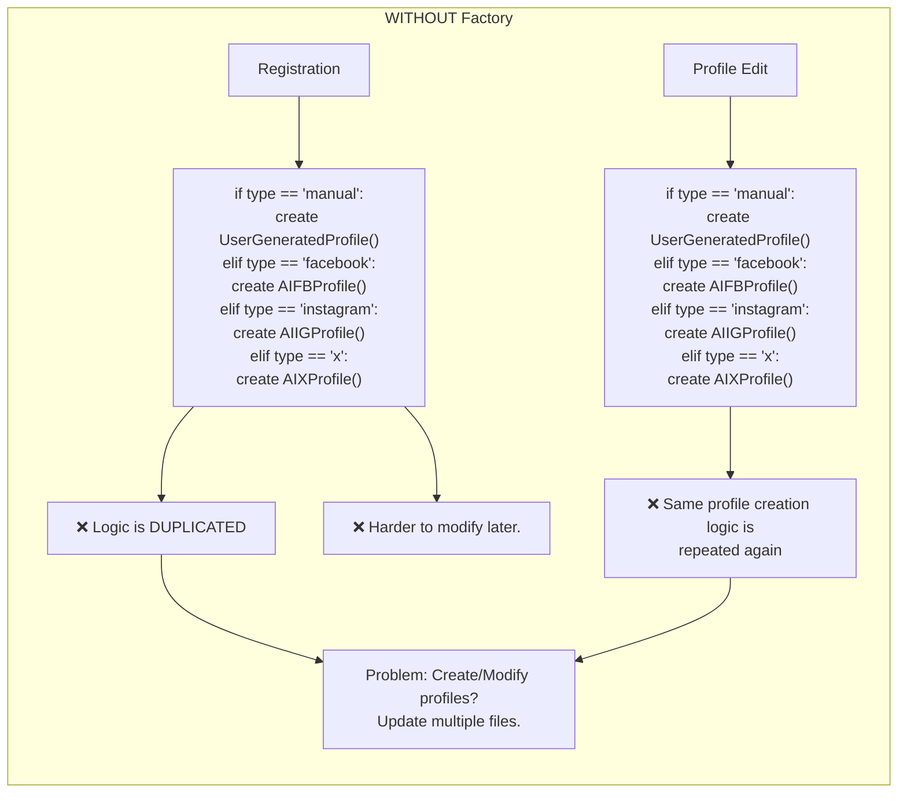
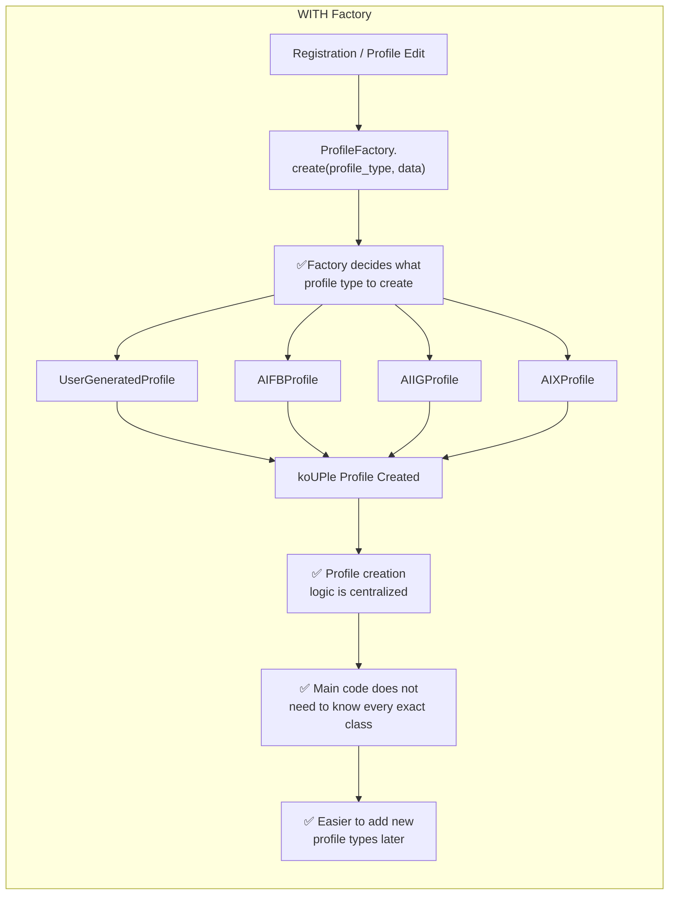

## FACTORY

#### Visual Diagram

##### Without Factory Pattern

```mermaid
flowchart TB
    subgraph W["WITHOUT Factory"]
        direction TB

        A[Registration] --> B["if type == 'manual':<br/>create UserGeneratedProfile()<br/>elif type == 'facebook':<br/>create AIFBProfile()<br/>elif type == 'instagram':<br/>create AIIGProfile()<br/>elif type == 'x':<br/>create AIXProfile()"]

        B --> C["❌ Logic is DUPLICATED"]
        B --> D["❌ Harder to modify later."]

        E[Profile Edit] --> F["if type == 'manual':<br/>create UserGeneratedProfile()<br/>elif type == 'facebook':<br/>create AIFBProfile()<br/>elif type == 'instagram':<br/>create AIIGProfile()<br/>elif type == 'x':<br/>create AIXProfile()"]

        F --> G["❌ Same profile creation logic is<br/>repeated again"]

        C --> H["Problem: Create/Modify profiles?<br/>Update multiple files."]
        G --> H
    end
```
##### WITH Factory Pattern

```mermaid
flowchart TD
    subgraph W["WITH Factory"]
        direction TB

        A["Registration / Profile Edit"] --> B["ProfileFactory.<br/>create(profile_type, data)"]

        B --> C["✅Factory decides what<br/>profile type to create"]

        C --> D["UserGeneratedProfile"]
        C --> E["AIFBProfile"]
        C --> F["AIIGProfile"]
        C --> G["AIXProfile"]

        D --> H["koUPle Profile Created"]
        E --> H
        F --> H
        G --> H

        H --> I["✅ Profile creation<br/>logic is centralized"]
        I --> J["✅ Main code does not<br/>need to know every exact class"]
        J --> K["✅ Easier to add new<br/>profile types later"]
    end
```
