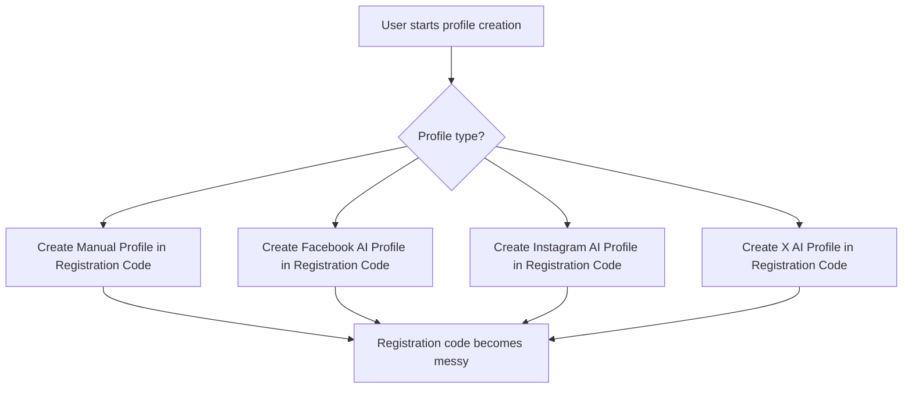
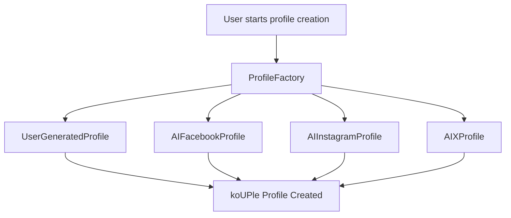

#### Without Factory Pattern

```mermaid
flowchart TD
    A[User starts profile creation] --> B{Profile type?}
    B --> C[Create Manual Profile in Registration Code]
    B --> D[Create Facebook AI Profile in Registration Code]
    B --> E[Create Instagram AI Profile in Registration Code]
    B --> F[Create X AI Profile in Registration Code]

    C --> G[Registration code becomes messy]
    D --> G
    E --> G
    F --> G
```

#### With Factory Pattern

```mermaid
flowchart TD
    A[User starts profile creation] --> B[ProfileFactory]
    B --> C[UserGeneratedProfile]
    B --> D[AIFacebookProfile]
    B --> E[AIInstagramProfile]
    B --> F[AIXProfile]

    C --> G[koUPle Profile Created]
    D --> G
    E --> G
    F --> G
```
