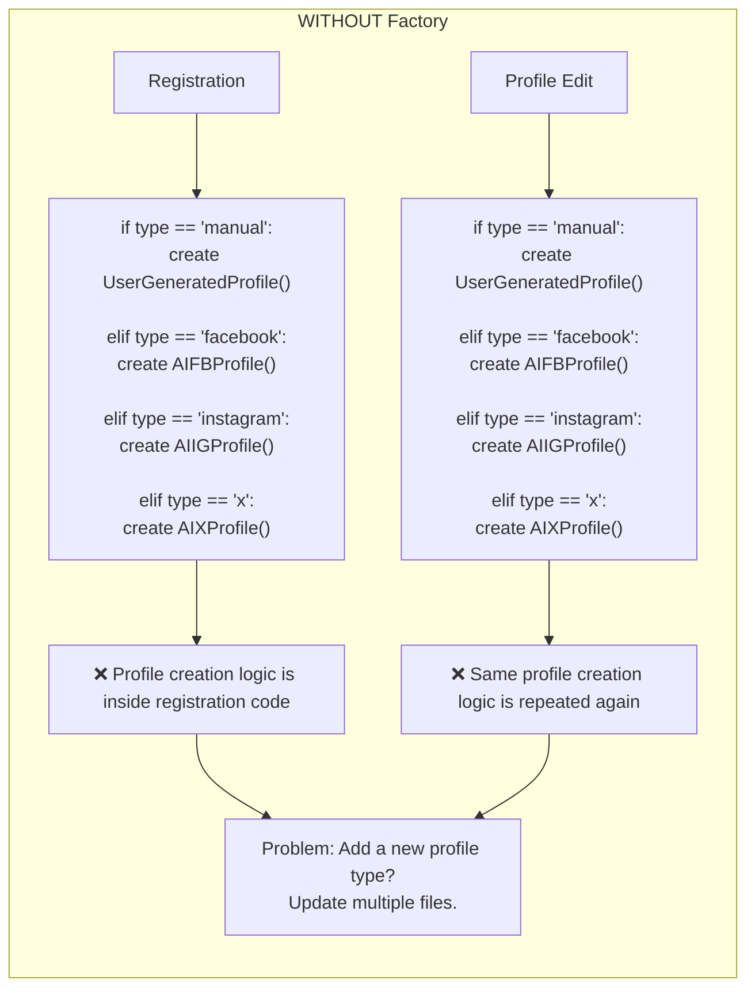
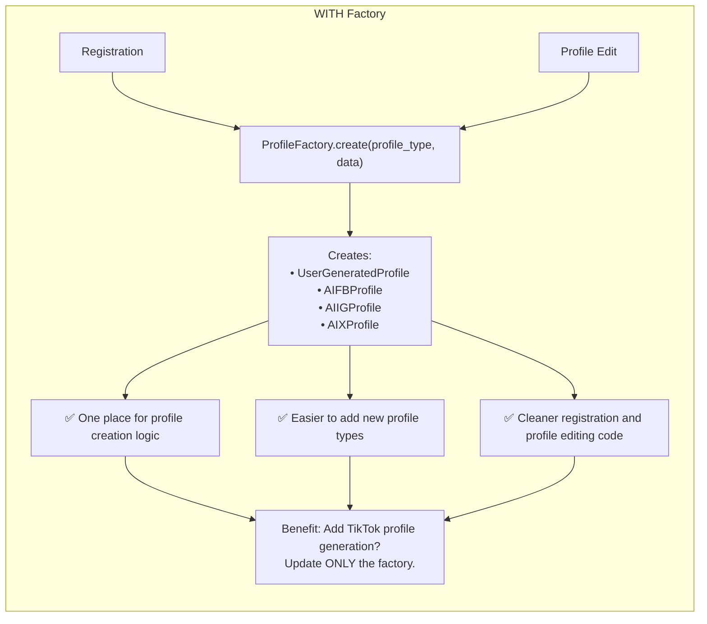

#### Visual Diagram

##### Without Factory Pattern

```mermaid
flowchart TD
    subgraph W["WITHOUT Factory"]
        direction TB

        A[Registration] --> B["if type == 'manual':<br/>create UserGeneratedProfile()<br/><br/>elif type == 'facebook':<br/>create AIFBProfile()<br/><br/>elif type == 'instagram':<br/>create AIIGProfile()<br/><br/>elif type == 'x':<br/>create AIXProfile()"]

        C[Profile Edit] --> D["if type == 'manual':<br/>create UserGeneratedProfile()<br/><br/>elif type == 'facebook':<br/>create AIFBProfile()<br/><br/>elif type == 'instagram':<br/>create AIIGProfile()<br/><br/>elif type == 'x':<br/>create AIXProfile()"]

        B --> E["❌ Profile creation logic is inside registration code"]
        D --> F["❌ Same profile creation logic is repeated again"]

        E --> G["Problem: Add a new profile type?<br/>Update multiple files."]
        F --> G
    end
```

##### With Factory Pattern

```mermaid
flowchart TD
    subgraph WF["WITH Factory"]
        direction TB

        A[Registration] --> C["ProfileFactory.create(profile_type, data)"]
        B[Profile Edit] --> C

        C --> D["Creates:<br/>• UserGeneratedProfile<br/>• AIFBProfile<br/>• AIIGProfile<br/>• AIXProfile"]

        D --> E["✅ One place for profile creation logic"]
        D --> F["✅ Easier to add new profile types"]
        D --> G["✅ Cleaner registration and profile editing code"]

        E --> H["Benefit: Add TikTok profile generation?<br/>Update ONLY the factory."]
        F --> H
        G --> H
    end
```
