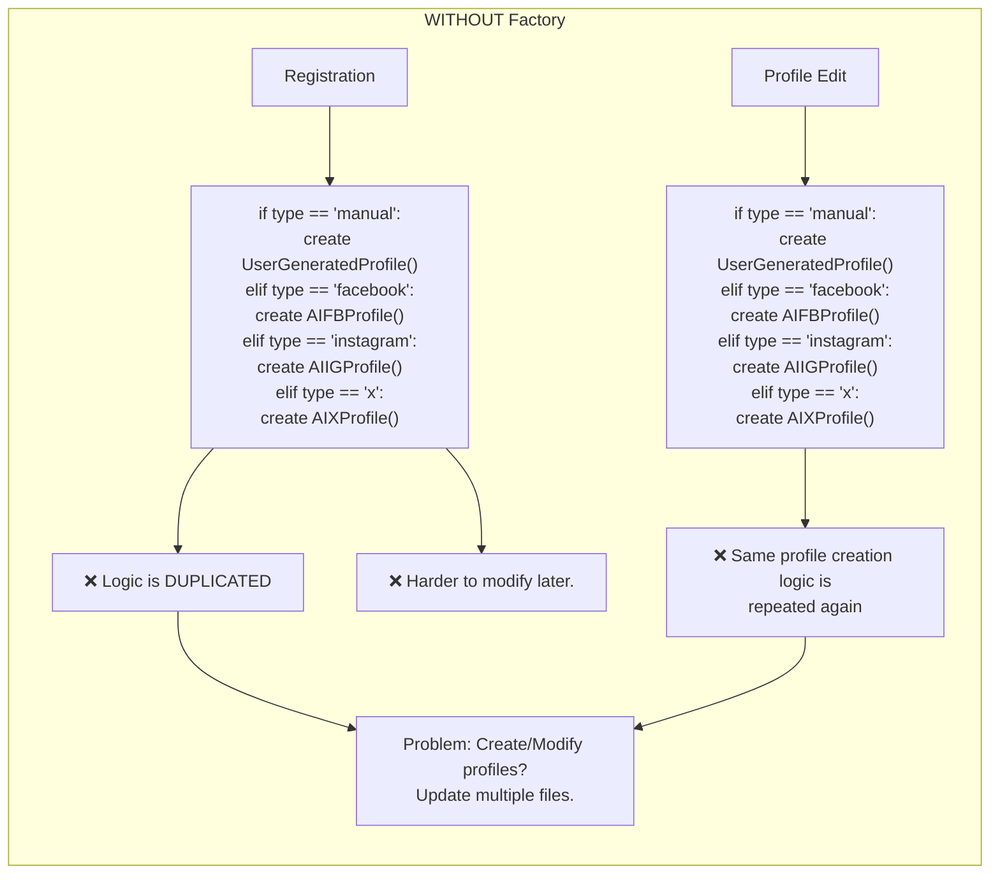

#### Visual Diagram

##### Without Factory Pattern

```mermaid
flowchart TB
    subgraph W["WITHOUT Factory"]
        direction TB

        A[Registration] --> B["if type == 'manual':<br/>create UserGeneratedProfile()<br/>elif type == 'facebook':<br/>create AIFBProfile()<br/>elif type == 'instagram':<br/>create AIIGProfile()<br/>elif type == 'x':<br/>create AIXProfile()"]

        B --> C["❌ Logic is DUPLICATED"]
        B --> D["❌ Harder to modify later."]

        E[Profile Edit] --> F["if type == 'manual':<br/>create UserGeneratedProfile()<br/>elif type == 'facebook':<br/>create AIFBProfile()<br/>elif type == 'instagram':<br/>create AIIGProfile()<br/>elif type == 'x':<br/>create AIXProfile()"]

        F --> G["❌ Same profile creation logic is<br/>repeated again"]

        C --> H["Problem: Create/Modify profiles?<br/>Update multiple files."]
        G --> H
    end
```
