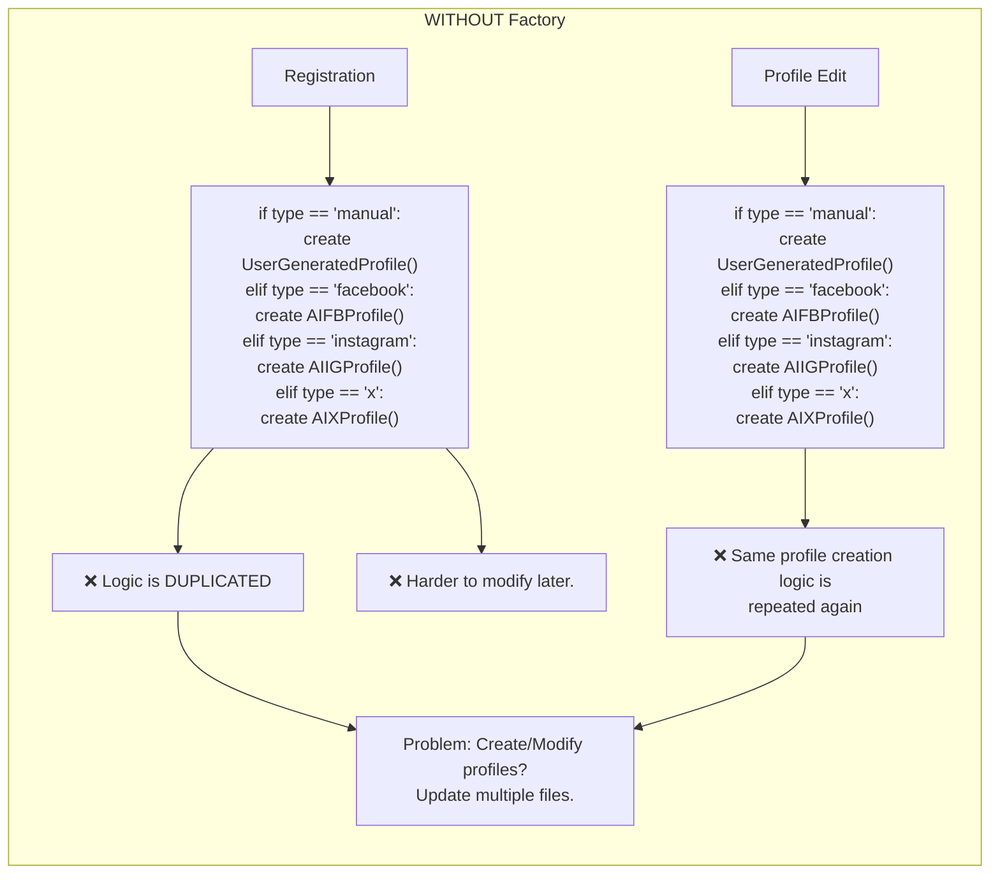
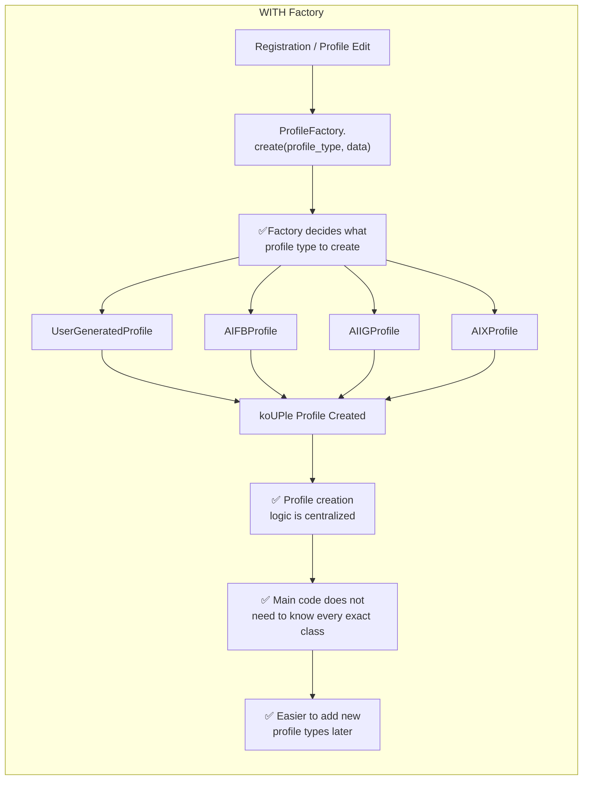
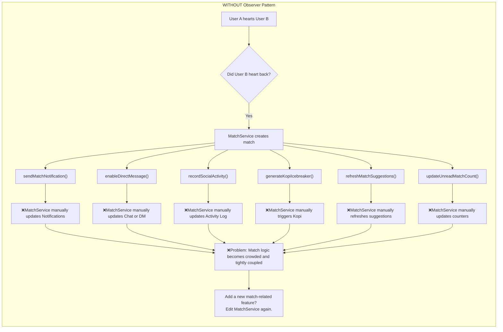
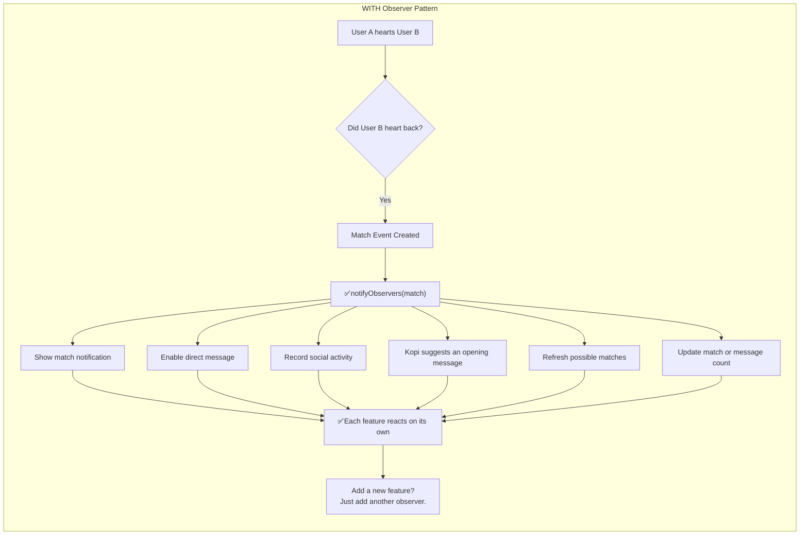
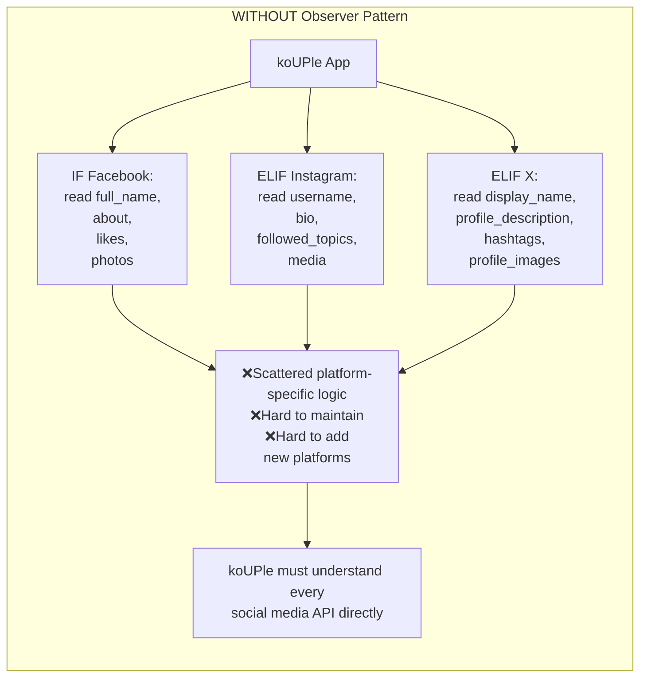

## FACTORY

#### Visual Diagram

##### Without Factory Pattern

##### WITH Factory Pattern

# OBSERVER

#### Visual Diagram

##### WITHOUT Observer Pattern

##### WITH Observer Pattern

# ADAPTER

#### Visual Diagram

##### WITHOUT Adapter Pattern

